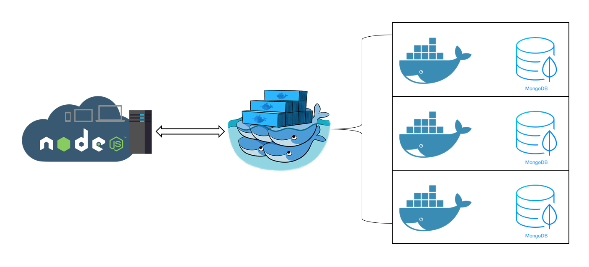

# CISC5950 Project Web Tutorial

Table of contents
=================
  * [Introduction](#introduction)
  * [Node.js Installation](#nodejs-installation)
  * [Express Deployment](#express)
  * [Node.js project](#nodejs-project)
  * [Front-End Render](#front-end-render)
  * [Rank of db](https://db-engines.com/en/ranking)
  * [demo](https://felixfang.com:3000)
  
  
Introduction
-----
   
- Server: Private Server 
- OS: Ubuntu 16.10(LTS)
- Framework: Node.js v4.2.6, Express 4.0, jQuery 3.2.1, Semantic-ui 2.2.13




Node.js-installation
-----

#### For Ubuntu 16.10
1. Update your local package
```sh
sudo apt-get update
```
2. Install Node.js
```sh
sudo apt-get install nodejs
```
3. Install npm
```sh
sudo apt-get install npm
```
4. Add symbolic link to nodejs
```sh
sudo ln -s /usr/bin/nodejs /usr/bin/node

```
#### For Windows
Download the latest Node.js installer from [Node.js Download](https://nodejs.org/en/download/) page.  

  

Follow the install instruction. 

Express
-----
1. Install Express
```sh
npm install express
```
2. Install express-generator
```sh
npm install express-generator -g
```
3. Generate you projet

We are using pug (used to be jade) as template engine
```sh
express --view=pug project
```
4. View your project
Your project file structure would be:
```
├── app.js
├── bin
│   └── www
├── package.json
├── public
│   ├── images
│   ├── javascripts
│   └── stylesheets
│       └── style.css
├── routes
│   ├── index.js
│   └── users.js
└── views
    ├── error.pug
    ├── index.pug
    └── layout.pug

7 directories, 9 files
```
5. Install all dependency and check
```sh
cd project && npm install
DEBUG=project:* npm start
curl http://localhost:3000/
```
> If you don't have curl, try `apt-get install curl`

6. Now start your project!

Node.js-project
-----
1. Install dependency  

Edit the package.json, add our needed packages e.g. {"mongodb": "2.2.33", "semantic-ui": "~2.2.13"} to the dependencies field.

```json
{
  "name": "project",
  "version": "0.0.0",
  "private": true,
  "scripts": {
    "start": "node ./bin/www"
  },
  "dependencies": {
    "body-parser": "~1.18.2",
    "cookie-parser": "~1.4.3",
    "debug": "~2.6.9",
    "express": "~4.15.5",
    "jade": "~1.11.0",
    "morgan": "~1.9.0",
    "serve-favicon": "~2.4.5",
    "mongodb": "2.2.33",
    "semantic-ui": "~2.2.13"
  }
}
```

2. Connect to the Mongodb  

Go to your `routes\index.js` or you can generate a new route to handle the POST or GET request.

```javascript
var MongoClient = require('mongodb').MongoClient;
var assert = require('assert');
var url = 'mongodb://your_ip_address/your_dbname';
MongoClient.connect(url, function (err, db) {
    assert.equal(null, err);
    console.log("Connected correctly to server");
    db.close();
});
```

3. Handle your POST and GET request/response  

Get your input POST 

```javascript
router.post('/', function (req, res, next) {
    var input = req.body.input;
});
```

Respond your POST using json 

```javascript
router.post('/', function (req, res, next) {
    res.send({'message': "Input invalid"});
});
```
4. Find documents using Mongodb  

```javascript
var col = db.collection('YOUR COLLECTION');
col.find({"YOUR QUERY KEY": "YOUR QUERY VALUE"}).limit(1).toArray(function (err, docs) {
    if (err) {
        console.log(err);
        res.send({'message': "internal error"});
    }else {
        res.send({'message': JSON.stringify(docs)});
    }
});
```
5. The entire code

```javascript
var express = require('express');
var router = express.Router();

'use strict';

/* GET block page. */
router.get('/', function (req, res, next) {
    res.send('get respond from blocks');

});

router.post('/', function (req, res, next) {
    var input = req.body.input;
    var length_input = input.length;
    var MongoClient = require('mongodb').MongoClient;
    var assert = require('assert');
    var url = 'mongodb://74.101.206.59:27017/blockdb';
    MongoClient.connect(url, function (err, db) {
        assert.equal(null, err);
        console.log("Connected correctly to server");
        var col = db.collection('blockchain');
        // var col = db.collection('block');
        if (length_input === 64) {
            console.log(input);
            col.find({"blocks.hash": input}).limit(1).toArray(function (err, docs) {
                if (err) {
                    console.log(err);
                    res.send({'message': "Internal error"});
                }else if (docs.length !== 1){
                    res.send({'message': "Input error, keyword not found"});
                }else{
                    console.log(docs);
                    res.send({'message': JSON.stringify(docs)});
                }
            });
        } else if (length_input < 10 && length_input > 0) {
            console.log(input);
            col.find({"blocks.height": Number(input)}).limit(1).toArray(function (err, docs) {
                if (err) {
                    console.log(err);
                    res.send({'message': "internal error"});
                }else if (docs.length !== 1){
                    res.send({'message': "Input error, keyword not found"});
                }else{
                    console.log(docs);
                    res.send({'message': JSON.stringify(docs)});
                }
            });
        } else {
            console.log("Input invalid");
            res.send({'message': "Input invalid"});
        }
        db.close();
    });
});
module.exports = router;
```
6. Using template engine

Jade is a template engine for better generate the HTML file.

The basic sytax is simple but powerful

```jade
 body
    div(id="modal2" class="ui modal")
        div(class="ui hidden divider")
        div(class="ui centered container")
            div(id="sc1" class="scrolling content")
                div(class="ui hidden divider")
        div(class="ui hidden divider")
```

Front-end-render
-----
We use jQuery and Ajax to handle all the async actions, code as follow:
```javascript
$(document).ready(function () {
    $('#button1').on('click', function () {
        $.ajax({
            url: '/blocks',
            type: 'POST',
            dataType: 'JSON',
            data: {input: $('#input1').val()},
            success: function (data) {
                var resultHTML = data.message;
                var block_obj = jQuery.parseJSON(resultHTML)
                // your code goes here...
            }
        });
    });
});
```

