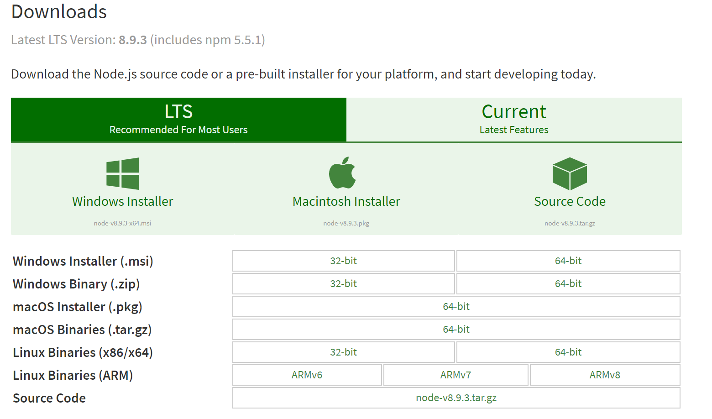

# CISC5950 Project Web Structure

Table of contents
=================
  * [Introduction](#Introduction)
  * [Node.js Installation](#Node.js-installation)
  * [Express Deployment](#Express)
  * [Router](#Router)
  

Introduction
-----
- Server: Private Server 
- OS: Ubuntu 16.10(LTS)
- Framework: Node.js v4.2.6, Express 4.0, jQuery 3.2.1, Semantic-ui 2.2.13


Node.js-installation
-----
#### For Ubuntu 16.10
1. Update your local package
```sh
sudo apt-get update
```
2. Install Node.js
```sh
sudo apt-get install nodejs
```
3. Install npm
```sh
sudo apt-get install npm
```
4. Add symbolic link to nodejs
```sh
sudo ln -s /usr/bin/nodejs /usr/bin/node

```
#### For Windows
Download the latest Node.js installer from [Node.js Download](https://nodejs.org/en/download/) page.  

Follow the install instruction. 


Express
-----